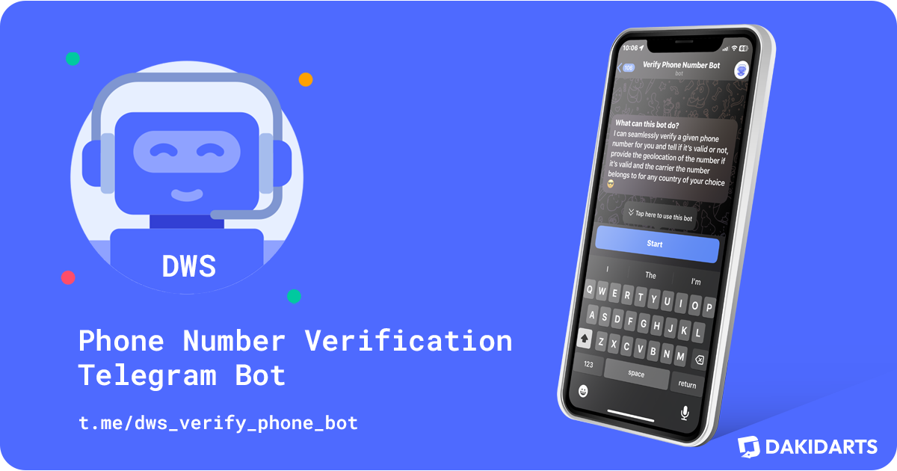

# Phone Number Verification Bot 📞✅

Welcome to the **Phone Number Verification Bot**! This Telegram bot helps you verify phone numbers, providing details about the country, location, phone type, and more. Built with Python and leveraging the power of RapidAPI, this bot is here to ensure you have accurate information at your fingertips.

## Features

- **Phone Number Verification**: Validate phone numbers with ease.
- **Country and Location Information**: Get details about the phone number's country and specific location.
- **Phone Type Identification**: Know whether the phone number is mobile, landline, etc.
- **Carrier Information**: Find out the carrier associated with the phone number.
- **Timezone Information**: Get the timezone related to the phone number.

## Commands

- `/start`: Welcome message and introduction to the bot.
- `/help`: Display a list of available commands and their usage.
- `/verify <phone> <country>`: Verify a phone number with the specified country code.

## Example Usage

To verify a phone number, simply use the following command:
`/verify 6502530000 US`

## Usage

You don't need to install anything to use this bot. Simply go to [t.me/dws_verify_phone_bot](https://t.me/dws_verify_phone_bot) on Telegram and start verifying phone numbers right away!

## Contributing

Contributions are welcome! Feel free to open issues or submit pull requests to help improve this bot.

## License

This project is licensed under the MIT License. See the [LICENSE](https://github.com/dakidarts/phone-number-verification-bot?tab=MIT-1-ov-file#) file for details.

## Contact

For any inquiries or support, reach out to us at [t.me/dakidarts](https://t.me/dakidarts).

---

Happy Verifying! 😊
